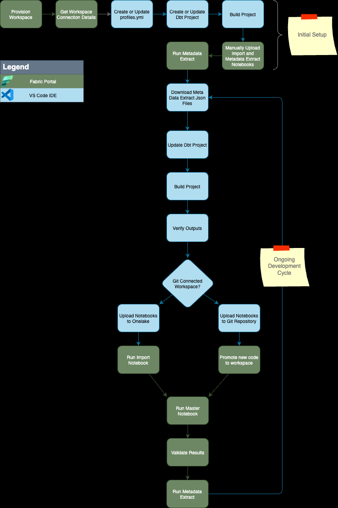

**Inital Setup**
1. Provision Workspace
   - **Development Environment:** Fabric Portal
   - **Re-occurence:** Do once per development environment set-up
   - **Instructions:** Create a new workspace in the Power BI Portal, or use an existing workspace.

2. Get Workspace Connection Details
   - **Development Environment:** Fabric Portal
   - **Re-occurence:** Do once per development environment set-up
   - **Instructions:** Get the workspace connection details from the Power BI Portal.
   
3. Create or Update `profiles.yml`
   - **Development Environment:** VS Code on local, developemnt machine
   - 

4. Create or Update `dbt_project.yml`
   
5. Build Project
6. Manually Upload Notebooks 
7. Run Meta Data Extract

**Ongoing Development Cycle**

8. Download Metadata: 
   
9.  Update Dbt Project 
10. Build Dbt Project 
11. Verify Outputs 
12. Update Notebooks
    <ol type="a">
        <li>Upload to Onelake</li>
        <li>Update to GIT repo</li>   
    </ol>    
13. Promote to Workspace
    <ol type="a">
        <li>Run Import Notebook</li>
        <li>Promote GIT branch</li>   
    </ol>   
14. Run Master Notebook 
15. Validate Results 
16. Run Metadata Extract