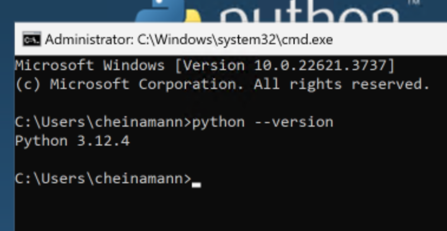
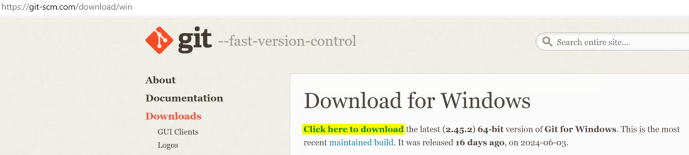
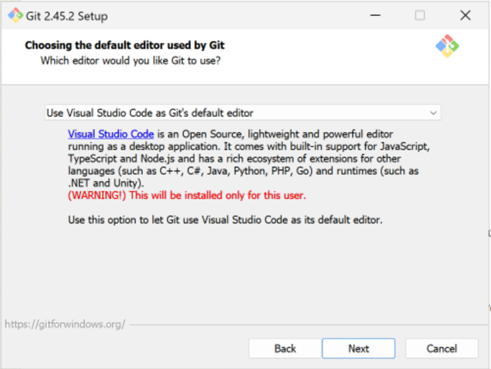
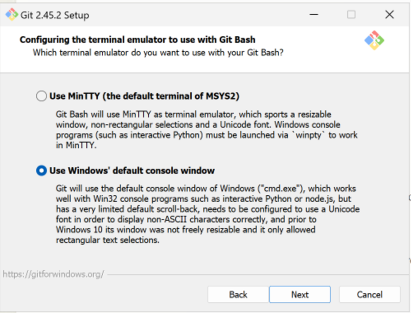

# Applications Required for Development (Windows)

This section covers the applications required for developing using the dbt framework. The applications are:

- python (latest version available)
- Visual Studio Code
- GIT for Windows
- OneLake Explorer (Preview)

### Install python
First you need to install python. This can be done from this link [Download Python | Python.org](https://www.python.org/downloads/) download the latest version and install it. 

**NOTE:** Make sure to tick the box on the first window of the installation to Add Python.exe to PATH

Use Install now for standard installation.

Once installed, confirm installation by opening the command line. WindowsKey + R then enter “cmd” click OK. 

Type the following and you should get a reply similar to the screenshot below.
```command prompt 
“python --version”
```



### Install Visual Studio Code
Browse to website [Visual Studio Code - Code Editing. Redefined](https://code.visualstudio.com/) and download Visual Studio Code and then open the file.

Select the standard options and install.

### Install GIT for Windows
Browse to website [Git - Downloading Package (git-scm.com)](https://git-scm.com/download/win) and download the latest by clicking “Click here to download” option. Open the file and install following the step examples.



Select the standard options until you get these next steps.

This step will ask you about your default git application please change this to Use Visual Studio Code as Git default. 



This step will ask you about your default git console, please select Use Windows default console window.



The rest of the installation options should be standard unless you need to change them for other reasons.

### OneLake Explorer (Preview)
Browse to website [OneLake Explorer](https://learn.microsoft.com/en-us/fabric/onelake/onelake-file-explorer) and browse down the page to Installation instructions and download OneLake file explorer and then open the file.

Click install and follow standard install options. 

Opening up for the first time will require you to login using your Fabric tenant details. You will then be able to access the Lakehouses from your Windows Explorer.


This concludes the required applications.