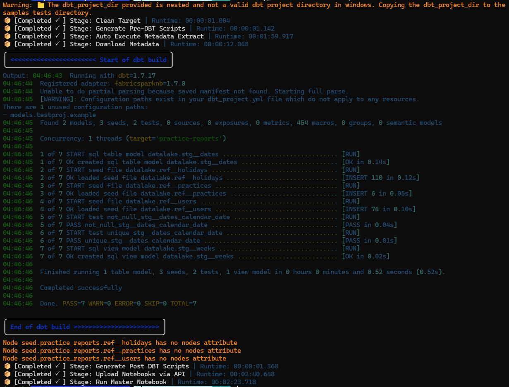
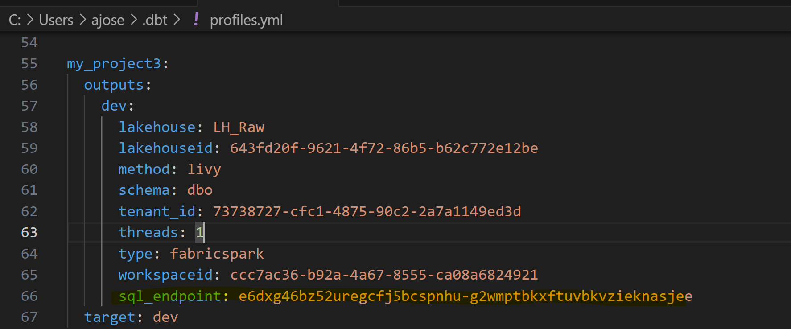
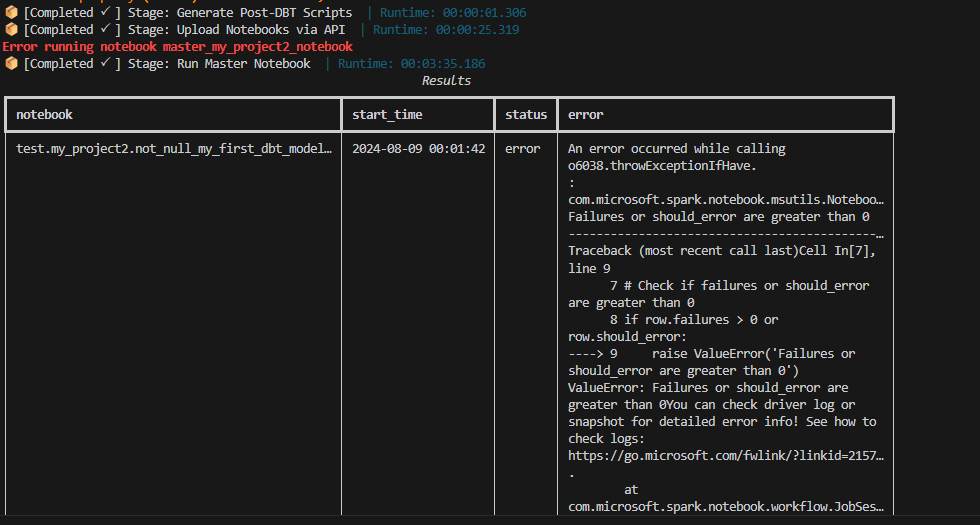

---

    title: "Dbt Build Process"
    excerpt: "This guide will walk you through the process of building your dbt project using the dbt-fabricsparknb package."
    sidebar_label: "Dbt Build Process"
    slug: /user_guide/dbt_build_process
    weight: 3

---

## Dbt Build Process & Dbt_Wrapper
The dbt-fabricksparknb package includes a console application that will allow you to build your dbt project and generate a series of notebooks that can be run in a Fabric workspace. This application is called `dbt_wrapper` and is a python script that is run from the command line. You can invoke the application and view information about it by running the following command in a terminal.

!!! Important
  
    Before running the dbt_wrapper make sure you're logged into your tenant in the PowerShell terminal using both az login. See the examples below and replace the tenant id with your own.

    ```powershell
    az login --tenant 73738727-cfc1-4875-90c2-2a7a1149ed3d --allow-no-subscriptions
    ```


!!! Note
    Make sure that you have activated your python virtual environment before running this code. 

```powershell
dbt_wrapper --help
```

To build your dbt project and publish your notebook to your Fabric workspace you can run the command below:

!!! note
    Be sure to replace ==my_project== with the name of your dbt project folder


```powershell
dbt_wrapper run-all my_project
```

The command above will carry out all of the necessary "stages" required to fully build your dbt project and generate the notebooks that can be run in a Fabric workspace. When run successfully your should see output similar to the image below.




!!!Tip
    - You can view the execution results of the master notebook directly in the console. To enable this, manually add the `sql_endpoint` of your default lakehouse in your `profile.yml`. (You can find the `sql_endpoint` value in your SQL connection string from the Fabric lakehouse.) 
    - Additionally, ensure that version 18 of the SQL Server driver is installed on your machine. Refer - [ODBC Driver for SQL Server](https://learn.microsoft.com/en-us/sql/connect/odbc/microsoft-odbc-driver-for-sql-server?view=sql-server-ver16) 

    
    
    Here is the sample scheenshot of the execution results of the master notebook directly in the console
    


## Toggling Build Stages Off and On 

There are times when you may not wish to run ALL of the build steps. In such circumstances you can toggle off specific stages by using the options built in to the `dbt_wrapper` application. To view all of the options available to you run the command below:

```powershell
dbt_wrapper run-all --help
```

For example, should you wish to run all stages except for the upload of the generated notebooks to your Fabric workspace you can run the command below:

```powershell
dbt_wrapper run-all my_project --no-upload-notebooks-via-api  
```
Alternatively, you might want to make use of some additional "helper" commands that we have included in the application. For example, Notebooks are defaulted to the timeout of 1800 seconds. You can increase that by passing a timeout configuration when building the project. 
!!!note
    you can change the int value to anything you want as long as it's not larger than 7 days in seconds

```powershell
dbt_wrapper run-all my_project --notebook-timeout=2100
```
The default lakehouse is set in the metadata of each notebook that gets created. You can override this and include a cell with the magic command %%configure to set the default lakehouse for the notebooks using this wrapper command when building:

```powershell
dbt_wrapper run-all my_project --lakehouse-config="CODE"
```

Review all of the commands available to you by running using the help option as shown below:

```powershell
dbt_wrapper --help
```

!!! Info
    You are now ready to move to the next step in which you gain an understanding of the various kinds of notebooks generated by the adapter. Follow the [Understanding the Generated Notebooks](./generated_notebooks.md) guide.

  
