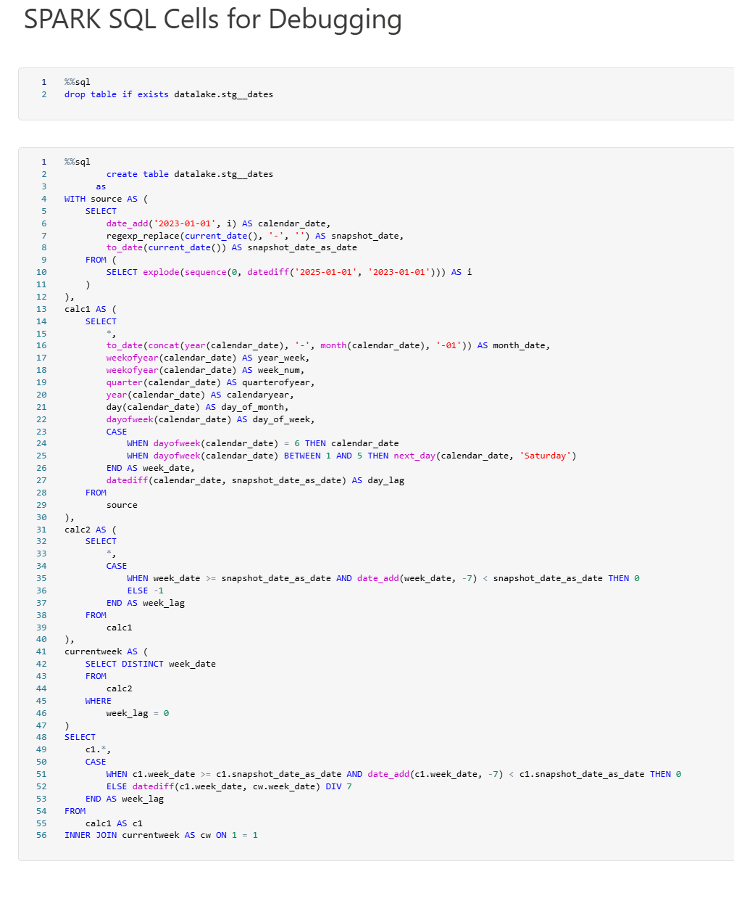

| Notebook Prefix | Description               |
| --------------- | --------------------------|
|  model.         |  These are dbt **model** notebooks. A notebook will be generated for each dbt **model** that you define. You will be able to run, debug and monitor execution of these notebooks directly in the Fabric portal independently of dbt.|
|  test.          |  These are dbt **test** notebooks. A notebook will be generated for each dbt **test** that you define. You will be able to run, debug and monitor execution of these notebooks directly in the Fabric portal independently of dbt. |
|  seed.          |  These are dbt **seed** notebooks. A notebook will be generated for each dbt **seed** that you define. You will be able to run, debug and monitor execution of these notebooks directly in the Fabric portal independently of dbt.|
|  master_        |  These are **execution orchestration** notebooks. They allow the running of your models, tests and seeds in parallel and in the correct order. They are what allow you to run your transformation pipelines independently of dbt as an orchestrator. In order to run your project simply schedule master.{project_name}.notebook.iypnb using Fabric's native scheduling functionality |
|  import_        |  This is a helper notebook that facilitate import of generated notebooks into workspace.  |
|  metadata_      |  This is a helper notebook to facilitate generation of workspace metadata json files.    |

??? Question "Notebooks with the Prefix `"model."`"
    These are dbt **model** notebooks. A notebook will be generated for each dbt **model** that you define. You will be able to run, debug and monitor execution of these notebooks directly in the Fabric portal independently of dbt.

    

    

??? Question "Notebooks with the Prefix `"test."`"
    These are dbt **test** notebooks. A notebook will be generated for each dbt **test** that you define. You will be able to run, debug and monitor execution of these notebooks directly in the Fabric portal independently of dbt.

??? Question "Notebooks with the Prefix `"seed."`"
    These are dbt **seed** notebooks. A notebook will be generated for each dbt **seed** that you define. You will be able to run, debug and monitor execution of these notebooks directly in the Fabric portal independently of dbt.

??? Question "Notebooks with the Prefix `"master_"`"
    These are **execution orchestration** notebooks. They allow the running of your models, tests and seeds in parallel and in the correct order. They are what allow you to run your transformation pipelines independently of dbt as an orchestrator. In order to run your project simply schedule master.{project_name}.notebook.iypnb using Fabric's native scheduling functionality.

??? Question "Notebooks with the Prefix `"import_"`"
    This is a helper notebook that facilitates import of generated notebooks into workspace.

??? Question "Notebooks with the Prefix `"metadata_"`"
    This is a helper notebook to facilitates the generation of workspace metadata json files.