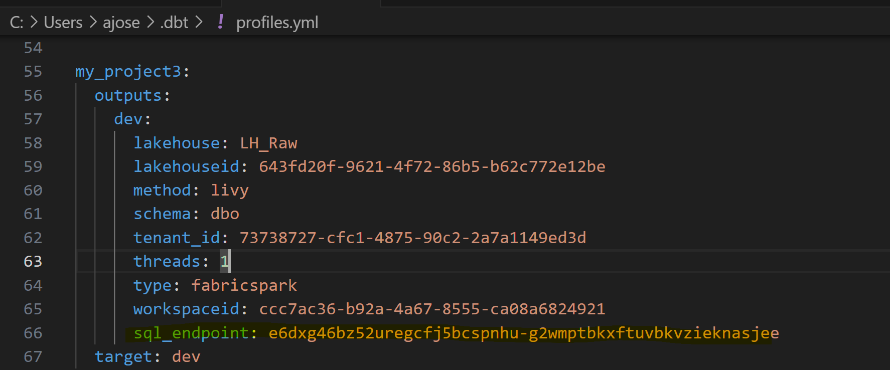
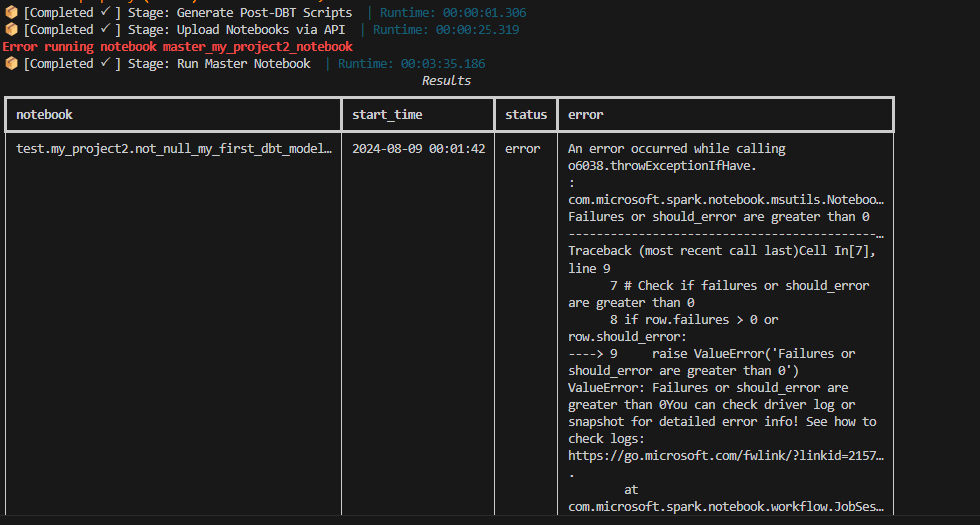

---

    title: "Dbt Build Process"
    excerpt: "This guide will walk you through the process of building your dbt project using the dbt-fabricsparknb package."
    sidebar_label: "Dbt Build Process"
    slug: /user_guide/dbt_build_process
    weight: 3

---

## Dbt Build Process & Dbt_Wrapper
The dbt-fabricksparknb package includes a console application that will allow you to build your dbt project and generate a series of notebooks that can be run in a Fabric workspace. This application is called `dbt_wrapper` and is a python script that is run from the command line.

The new version of `dbt_wrapper` provides **intuitive, workflow-based commands** that make it much easier to understand and use. Instead of complex flag combinations, you now choose workflows that match your intent.

!!! Important
  
    Before running the dbt_wrapper make sure you're logged into your tenant in the PowerShell terminal using both az login. See the examples below and replace the tenant id with your own.

    ```powershell
    az login --tenant 73738727-cfc1-4875-90c2-2a7a1149ed3d --allow-no-subscriptions
    ```

!!! Note
    Make sure that you have activated your python virtual environment before running this code. 

## Quick Start - Choose Your Workflow

View all available commands:
```powershell
dbt_wrapper --help
```

### 🚀 Development Workflow
Perfect for rapid development and testing cycles:
```powershell
dbt_wrapper dev my_project
```
*Runs: clean → pre-scripts → metadata → build → post-scripts*

### 🚢 Deploy Workflow  
Complete deployment pipeline with Fabric upload and execution:
```powershell
dbt_wrapper deploy my_project
```
*Runs: clean → pre-scripts → metadata → build → post-scripts → upload → execute*

### 🔨 Build Only
Minimal workflow - just builds the dbt project:
```powershell
dbt_wrapper build my_project
```
*Runs: metadata-download → build*

### 🧪 Test Workflow
Validation-focused pipeline without deployment:
```powershell
dbt_wrapper test my_project
```
*Runs: clean → metadata → build → validation*

!!! tip "New in this version"
    The new workflow-based commands are much more intuitive than the old `run-all` command with its many flags. Each workflow is designed for a specific use case.


!!!Tip
    - You can view the execution results of the master notebook directly in the console. To enable this, manually add the `sql_endpoint` of your default lakehouse in your `profile.yml`. (You can find the `sql_endpoint` value in your SQL connection string from the Fabric lakehouse.) 
    - Additionally, ensure that version 18 of the SQL Server driver is installed on your machine. Refer - [ODBC Driver for SQL Server](https://learn.microsoft.com/en-us/sql/connect/odbc/microsoft-odbc-driver-for-sql-server?view=sql-server-ver16) 

    
    
    Here is the sample scheenshot of the execution results of the master notebook directly in the console
    


## Advanced Usage

### Customizing Workflows

#### Skip Specific Stages
You can skip stages you don't need:
```powershell
# Skip upload for local development
dbt_wrapper deploy my_project --skip upload,execute

# Run only specific stages
dbt_wrapper deploy my_project --only build,post-scripts
```

#### Stage Management
For granular control, use the stage commands:
```powershell
# List all available stages
dbt_wrapper stage list

# Get details about a specific stage
dbt_wrapper stage describe build

# Run specific stages only
dbt_wrapper stage run clean metadata-extract build
```

### Configuration File Approach
Create a `.dbt-wrapper.yml` file to define custom workflows:

```powershell
# Initialize a configuration file
dbt_wrapper config init

# List workflows from config
dbt_wrapper config list

# Run a configured workflow
dbt_wrapper run --workflow my-custom-workflow
```

### Interactive Mode
For guided execution:
```powershell
dbt_wrapper run --interactive
```

### Common Options

#### Notebook Timeout
Notebooks default to 1800 seconds timeout. You can change this:
```powershell
dbt_wrapper deploy my_project --notebook-timeout 3600
```

!!! note
    Timeout value can be anything up to 7 days in seconds

#### Lakehouse Configuration
Control how lakehouse is set in notebook metadata:
```powershell
# Use code-based lakehouse configuration (adds %%configure cell)
dbt_wrapper deploy my_project --lakehouse-config CODE

# Use metadata-based configuration (default)
dbt_wrapper deploy my_project --lakehouse-config METADATA
```

#### dbt Resource Selection
Use standard dbt selection syntax:
```powershell
# Select specific models
dbt_wrapper dev my_project --select tag:daily

# Exclude certain models  
dbt_wrapper dev my_project --exclude tag:hourly
```

### Legacy Command Support
The old `run-all` command is still supported for backwards compatibility:
```powershell
dbt_wrapper run-all my_project  # Still works, but deprecated
```

!!! warning "Migration Recommended"
    We recommend migrating to the new workflow commands. See the [Migration Guide](migration_guide.md) for help transitioning from old commands.

!!! Info
    You are now ready to move to the next step in which you gain an understanding of the various kinds of notebooks generated by the adapter. Follow the [Understanding the Generated Notebooks](./generated_notebooks.md) guide.

  
